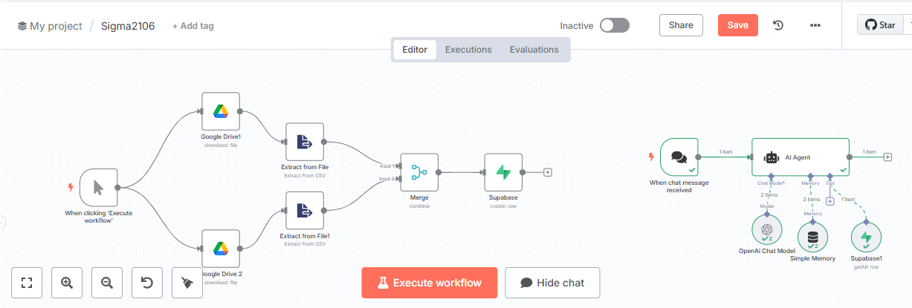
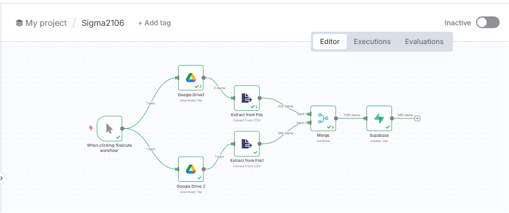
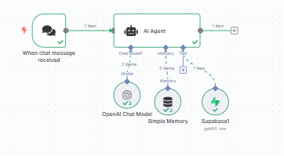
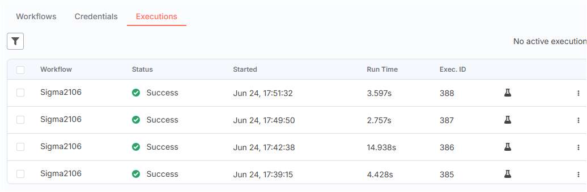

# DESAFIO 002 — Agente Autônomo para Análise de Notas Fiscais

## 🧠 Objetivo

Desenvolver um agente inteligente com uso de LLM (Large Language Model) que responda a perguntas sobre dados de notas fiscais extraídas de arquivos CSV. O projeto utiliza o **n8n** como orquestrador de fluxo, **Supabase** como banco de dados e **OpenAI** como motor de interpretação.

---

## 📐 Arquitetura

### Tecnologias e Serviços

- **n8n**: Plataforma de automação para orquestração do fluxo.
- **Google Drive**: Armazenamento dos arquivos CSV contendo notas fiscais.
- **Supabase**: Banco de dados relacional onde os dados são estruturados.
- **OpenAI GPT-4o**: Modelo responsável por interpretar perguntas e gerar respostas.

---

## 📁 Estrutura do Fluxo

### 1. Ingestão de Dados

- Dois arquivos `.csv` são baixados do Google Drive:
  - `202401_NFs_Cabecalho.csv`: Cabeçalho das notas fiscais.
  - `202401_NFs_Itens.csv`: Itens das notas fiscais.

- Cada arquivo é convertido do formato binário para JSON.
- Os arquivos são **unificados (merge)** utilizando o campo `"CHAVE DE ACESSO"`.

### 2. Armazenamento

- Os dados combinados são inseridos em uma tabela no Supabase chamada `sigmaai`.
- Todos os campos relevantes da nota fiscal são mapeados com `{{$json["..."]}}`.

### 3. Interação com Usuário (Agente de IA)

- O usuário envia uma pergunta via chat.
- O prompt do agente determina:
  - Tom educado e explicativo.
  - Clareza na resposta.
  - Capacidade de reconhecer perguntas fora de escopo.

- O agente se conecta:
  - Ao **Supabase** para consultar os dados.
  - Ao **modelo GPT-4o (OpenAI)** para gerar a resposta.

---

## 🧠 Exemplos de Perguntas e Respostas

| Pergunta                                      | Resposta (exemplo gerado)                                                                                                      |
|-----------------------------------------------|--------------------------------------------------------------------------------------------------------------------------------|
| Qual fornecedor tem a nota fiscal mais alta?  | O fornecedor com a nota fiscal mais alta é a CHEMYUNION LTDA, com um valor de R$ 1.292.418,75                                  |
| Qual CFOP foi mais utilizado?                 | A operação realizada com o CFOP 5102 foi utilizada 20 vezes.                                                                   |
| Qual estado concentrou o maior valor de notas recebidas? | O estado que concentrou o maior valor de notas recebidas foi o de São Paulo, com um total de R$ 15.683.768,31                  |
| Qual item teve o maior volume total entregue em quantidade?    | O item que teve o maior volume total entregue em quantidade foi o HGC 4 Branco/Branco-300-CP, com um total de 66.000 unidades. |

---

## 📌 Arquivo do Projeto

- O fluxo completo está descrito em `workflow-desafio02.json`.
- Ele contém:
  - Trigger manual (`manualTrigger`)
  - Integração com Google Drive e Supabase
  - Nó `AI Agent` com memória, modelo e ferramenta conectados
  - Prompt customizado para gerar respostas humanas e claras

---

## ▶️ Execução

Para executar localmente via n8n:

1. Importe o arquivo `workflow-desafio02.json`.
2. Configure:
   - Conexão com o Google Drive.
   - API Key do Supabase.
   - API Key da OpenAI.
3. Clique em **Execute workflow**.
4. Faça perguntas via chat como:
   - `"Qual item teve o maior volume?"`
   - `"Qual fornecedor mais vendeu?"`

---

## 📊 Visuais do Projeto

### 🧩 Fluxo Geral

### 🔄 Pipeline de Dados

### 🤖 Agente de IA

### 🤖 Banco de dados

---

## ✅ Conclusão

Esse projeto demonstrou como integrar diferentes fontes de dados e inteligência artificial em um único fluxo automatizado, facilitando o acesso a informações fiscais de maneira prática, humanizada e acessível a usuários leigos.

---

## 👥 Equipe

- Bruno Urbano Rodrigues
- Eduardo Carvalho Ramos  
- Jean Carlo Rodrigues Schuchardt Burda  
- Julia Roehe  
- Laertes Pereira Junior  
- Marisa De Camargo Silveira  
- Rafael Herden Campos  
- Vinicius Henrich

---

## 🔒 Classificação

> **Classificação:** Restrito — uso interno acadêmico e profissional.
